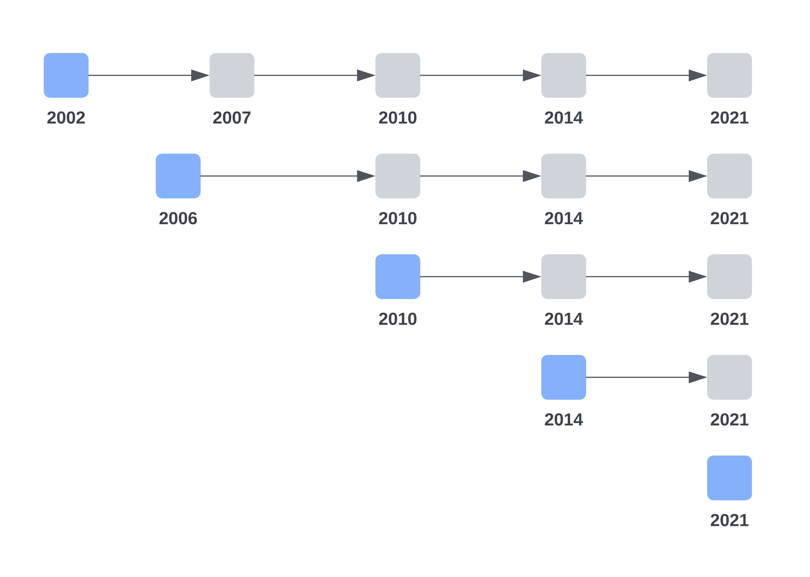

### This repository contains the R scripts for:

[Author list]. **Population Trends and Individual Fluidity of Self-Reported Sexual Identity in Stockholm County, 2010 to 2021.** 2024. _In Preparation._

The R scripts include:
* **SPHC-2010.Rmd:** analyses of sexual identity in 2010.
* **SPHC-2014.Rmd:** analyses of sexual identity in 2014.
* **SPHC-2021.Rmd:** analyses of sexual identity in 2021.
* **SPHC-F-2010-2021.Rmd:** analyses of changes in sexual identity from 2010 to 2021.
* **Summary_plots.Rmd:** drawing summary plots.

<small>_Notes:_ SPHC, Stockholm Public Health Cohort.‘SPHC-B + YEAR’ refers to the baseline survey; for example, SPHC-B 2010 represents the baseline survey conducted in 2010. ‘SPHC-F + YEAR’ refers to the follow-up survey; for example, SPHC-F 2014 represents all the follow-up surveys conducted in 2014. ‘SPHC + YEAR’ refers to both baseline and follow-up surveys; for example, SPHC 2010 denotes the baseline survey in 2010 and subsequent follow-up surveys in 2014 and 2021. See Figure 1 below for an overview of SPHC surveys.<small>

 

<small>**Figure 1. Overview of the Baseline and Follow-Up Surveys in the Stockholm Public Health Cohort 2002–2021** <small>
<small>The baseline surveys are denoted by blue-colored boxes, each labeled with the respective calendar year. Participants from each baseline survey were followed longitudinally through to 2021, which is indicated by grey-colored boxes alongside their corresponding years.<small>

**Data Availability** 
The dataset used in these analyses is available upon request. Interested investigators can access the data by submitting an application due to privacy and ethical considerations. For more information on the application process, please refer to the [Stockholm Public Health Cohort's data access guidelines](https://www.ces.regionstockholm.se/projekt-och-uppdrag/halsa-stockholm/SPHC-data/).

**Contact** 
For any queries related to this repository, please contact: [Guoqiang Zhang](https://ki.se/en/people/guoqiang-zhang), Email: guoqiang.zhang@ki.se.

**License** 
This work is licensed under the [Creative Commons Attribution 4.0 International License](https://creativecommons.org/licenses/by/4.0/) (CC BY 4.0), which allows others to distribute, remix, adapt, and build upon the work, even commercially, as long as they credit the authors for the original creation.
